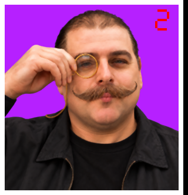
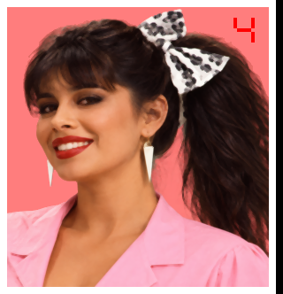
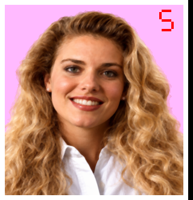

# Preserved opponent portrait sources

These are lossless copies of the selected images used to prepare the final
portraits in `assets/opponents/game/`. The `game-sources` archive contains the six
selected photographs and six 4x working tiles for future edits and reference,
independently of ignored build output and local generated-image storage.

- `full-resolution/`: the six selected photographic sources, before resizing.
- `working-4x/`: 320 x 332 RGB tiles, four times the original width and height.
  These include the original border and number, before the final half-size
  reduction and game-palette conversion.

Otto's selected source has the cord curving over his shoulder, as requested.
Bernie's selected source has the corrected green shirt collars. Cherry's source
also restores the far-side triangular earring visible in the original portrait,
with a longer pointed tip. The committed photograph supplies every pixel outside
the localized earring patch, preserving its original detail and sharpness.

## Selected full-resolution images

| Opponent | Full-resolution source | 4x working tile | Final game tile |
| --- | --- | --- | --- |
| 1. Squealin' Bernie Rubber | [View 1215 x 1295](full-resolution/opp1.png) | [View 320 x 332](working-4x/opp1.png) | [View 160 x 166](../../../assets/opponents/game/opp1.png) |
| 2. Herr Otto Partz | [View 1215 x 1295](full-resolution/opp2.png) | [View 320 x 332](working-4x/opp2.png) | [View 160 x 166](../../../assets/opponents/game/opp2.png) |
| 3. Smokin' Joe Stallin | [View 1214 x 1296](full-resolution/opp3.png) | [View 320 x 332](working-4x/opp3.png) | [View 160 x 166](../../../assets/opponents/game/opp3.png) |
| 4. Cherry Chassis | [View 1214 x 1296](full-resolution/opp4.png) | [View 320 x 332](working-4x/opp4.png) | [View 160 x 166](../../../assets/opponents/game/opp4.png) |
| 5. Helen Wheels | [View 1214 x 1296](full-resolution/opp5.png) | [View 320 x 332](working-4x/opp5.png) | [View 160 x 166](../../../assets/opponents/game/opp5.png) |
| 6. Skid Vicious | [View 1214 x 1296](full-resolution/opp6.png) | [View 320 x 332](working-4x/opp6.png) | [View 160 x 166](../../../assets/opponents/game/opp6.png) |

## Working-image gallery

| Bernie | Otto | Joe |
| --- | --- | --- |
|  |  |  |

| Cherry | Helen | Skid |
| --- | --- | --- |
|  |  |  |

## Rebuilding and provenance

Run from the repository root with Pillow and the original game data available:

```sh
python3 tools/scripts/prepare-original-opponent-upscales.py
python3 tools/scripts/prepare-original-opponent-upscales.py --check
```

The script reads `full-resolution/`, prepares `working-4x/`, and writes the final
indexed tiles into `assets/opponents/game/`. `--check` verifies without writing.
When selecting a new source, update the [archive manifest](manifest.json) and
[generation records](../game2-generation-prompts.json). The manifest records
dimensions and SHA-256 hashes so the preserved files can be checked exactly.
Historical prompt text and generated source paths remain in the generation
records; `preserved_*` fields refer only to images retained in this archive.

Cherry's [RGBA earring patch](patches/opp4-right-earring.png) and
[composition record](patches/opp4-right-earring.json) preserve the localized edit.
The record identifies the committed base photograph, staged donor, patch placement,
and hashes. To reconstruct the full-resolution image with Pillow, load the base
with `git cat-file blob <base_blob>` using the recorded object ID, load it as RGB,
and load the patch as RGBA, then use
`base.paste(patch, (179, 691), patch)`. Only 2,778 pixels change; every pixel outside
the earring patch remains identical to the committed photograph.
