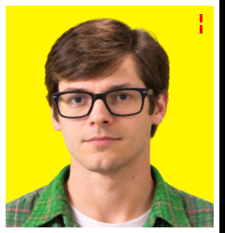
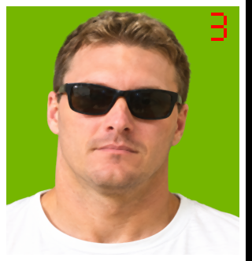
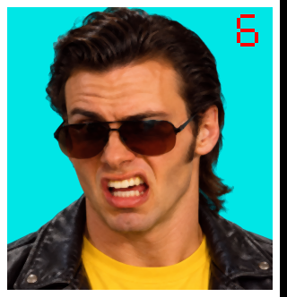

# Preserved opponent portrait sources

These are lossless copies of the images used to prepare the `game2` portraits.
They are kept with the project for future edits and reference, independently of
ignored build output and local generated-image storage.

- `full-resolution/`: the six selected photographic sources, before resizing.
- `working-4x/`: 320 x 332 RGB tiles, four times the original width and height.
  These include the original border and number, before the final half-size
  reduction and game-palette conversion.
- `history/`: earlier Bernie and Otto variants retained for reference.

Otto's selected source has the cord curving over his shoulder, as requested.
Bernie's selected source has the corrected green shirt collars.

## Selected full-resolution images

| Opponent | Full-resolution source | 4x working tile | Final game tile |
| --- | --- | --- | --- |
| 1. Squealin' Bernie Rubber | [View 1215 x 1295](full-resolution/opp1.png) | [View 320 x 332](working-4x/opp1.png) | [View 160 x 166](../../../assets/opponents/game2/opp1.png) |
| 2. Herr Otto Partz | [View 1215 x 1295](full-resolution/opp2.png) | [View 320 x 332](working-4x/opp2.png) | [View 160 x 166](../../../assets/opponents/game2/opp2.png) |
| 3. Smokin' Joe Stallin | [View 1214 x 1296](full-resolution/opp3.png) | [View 320 x 332](working-4x/opp3.png) | [View 160 x 166](../../../assets/opponents/game2/opp3.png) |
| 4. Cherry Chassis | [View 1214 x 1296](full-resolution/opp4.png) | [View 320 x 332](working-4x/opp4.png) | [View 160 x 166](../../../assets/opponents/game2/opp4.png) |
| 5. Helen Wheels | [View 1214 x 1296](full-resolution/opp5.png) | [View 320 x 332](working-4x/opp5.png) | [View 160 x 166](../../../assets/opponents/game2/opp5.png) |
| 6. Skid Vicious | [View 1214 x 1296](full-resolution/opp6.png) | [View 320 x 332](working-4x/opp6.png) | [View 160 x 166](../../../assets/opponents/game2/opp6.png) |

## Working-image gallery

| Bernie | Otto | Joe |
| --- | --- | --- |
|  |  |  |

| Cherry | Helen | Skid |
| --- | --- | --- |
|  |  |  |

## Earlier alternatives

| Image | Description |
| --- | --- |
| [Bernie before corrections](history/opp1-before-corrections.png) | Original collar colors. |
| [Otto before corrections](history/opp2-before-corrections.png) | Earlier mouth, shirt and cord. |
| [Otto with branched cord](history/opp2-branched-cord.png) | Both shoulder curve and dangling section. |
| [Otto with vertical cord](history/opp2-vertical-cord.png) | Alternative without the shoulder curve. |

## Rebuilding and provenance

Run from the repository root with Pillow and the original game data available:

```sh
python3 tools/scripts/prepare-original-opponent-upscales.py
python3 tools/scripts/prepare-original-opponent-upscales.py --check
```

The script reads `full-resolution/`, prepares `working-4x/`, and writes the final
indexed tiles into `assets/opponents/game2/`. `--check` verifies without writing.
When selecting a new source, preserve the previous version in `history/` and
update the [archive manifest](manifest.json) and
[generation records](../game2-generation-prompts.json). The manifest records
dimensions and SHA-256 hashes so the preserved files can be checked exactly.
